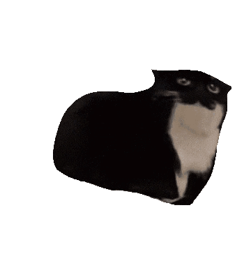

  ⋆.————————————————ᯓ★————————————————⋆.˚

  

  

<pre>
⠀⠀⠀⠀⠀⠀⠀⠀⠀⢀⣠⣤⣶⣶⣶⣶⣶⣤⣄⡀⠀⠀⠀⠀⠀⠀
⠀⠀⠀⠀⠀⠀⣠⣴⣾⣿⣿⣿⣿⣿⣿⣿⣿⣿⣿⣿⣿⣶⣄⡀⠀⠀⠀⠀⠀
⠀⠀⠀⣠⣴⣴⣿⣿⣿⣿⣿⣿⣿⣿⣿⣿⣿⣿⣿⣿⣿⣿⣿⣮⣵⣄⠀⠀⠀
⠀⠀⢾⣻⣿⢿⣿⣿⣿⣿⣿⣿⣿⣿⣿⣿⣿⣿⣿⣿⣿⣿⣿⣿⢿⣿⣿⡀⠀
⠀⠸⣽⣻⠃⣿⡿⠋⣉⠛⣿⣿⣿⣿⣿⣿⣿⣿⣏⡟⠉⡉⢻⣿⡌⣿⣳⡥⠀
⠀⢜⣳⡟⢸⣿⣷⣄⣠⣴⣿⣿⣿⣿⣿⣿⣿⣿⣿⣿⣧⣤⣠⣼⣿⣇⢸⢧⢣⠀
⠀⠨⢳⠇⣸⣿⣿⢿⣿⣿⣿⣿⡿⠿⠿⠿⢿⣿⣿⣿⣿⣿⣿⣿⣿⠀⡟⢆⠀
⠀⠀⠈⠀⣾⣿⣿⣼⣿⣿⣿⣿⡀⠀⠀⠀⠀⣿⣿⣿⣿⣿⣽⣿⣿⠐⠈⠀⠀
⠀⢀⣀⣼⣷⣭⣛⣯⡝⠿⢿⣛⣋⣤⣤⣀⣉⣛⣻⡿⢟⣵⣟⣯⣶⣿⣄⡀⠀
⣴⣿⣿⣿⣿⣿⣿⣿⣿⣿⣷⣶⣶⣶⣾⣶⣶⣴⣾⣿⣿⣿⣿⣿⣿⢿⣿⣿⣧
⣿⣿⣿⠿⢿⣿⣿⣿⣿⣿⣿⣿⣿⣿⣿⣿⣿⣿⣿⣿⣿⣿⣿⣿⣿⠿⠿⣿⡿
</pre>

  
  I'm an <b>IT Student</b> who is <b>still figuring things out, constantly learning, and actively developing my skills</b> in the tech world!

  I enjoy experimenting with code, exploring different paths in software, and building practical applications as I learn. My primary focus right now is consistency and growth.

  

  ⋆.————————————————ᯓ★————————————————⋆.

  <b>Languages & Web Dev</b>
  

    
    
    
    
  

  <b>Deployment & Backend</b>
  

    
    
    
    
  

  <b>Design & Art Tools</b>
  

    
    
    
  

 

  ⋆.—————————————————————————————ᯓ★—————————————————————————————⋆.

  

  ### Featured Projects
 

  
｡𖦹°‧ᵎᵎ

   

  * **[Digital Inventory Web App](https://thetradingpost.vercel.app)** — Interactive product catalog for digital items for a game.
  * **[Digital ID Card](https://picopicoctrl.github.io/mei-idcard)** — Custom digital card made with HTML and CSS.
  * **[Weather-Plant Game](https://picopicoctrl.github.io/mei-idcard/project.html)** — Integrated weather API data with game mechanics and pixel art assets.
  * **ClrSpot** — View and manage live available seats in the school library in real time.
  * **Lost & Found Web App** — Digitalized system to track lost items on campus.

 
